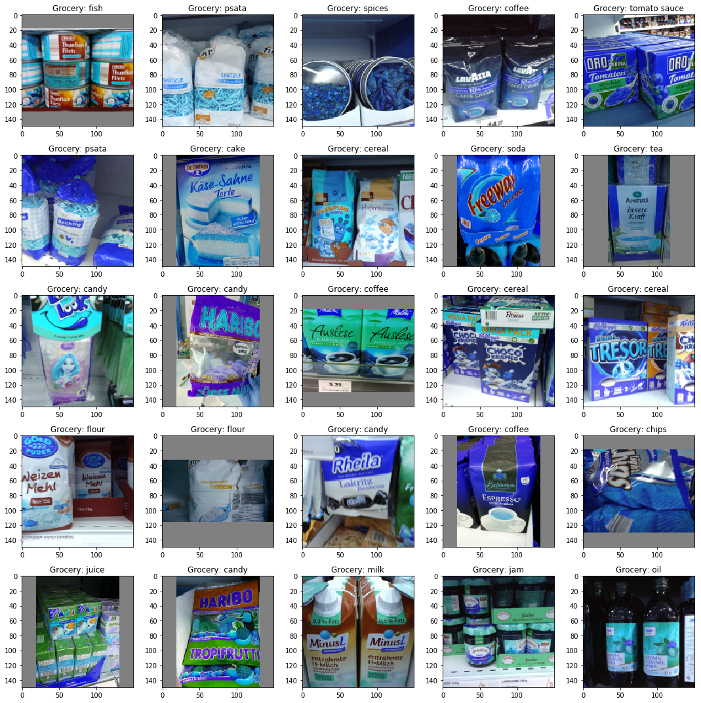
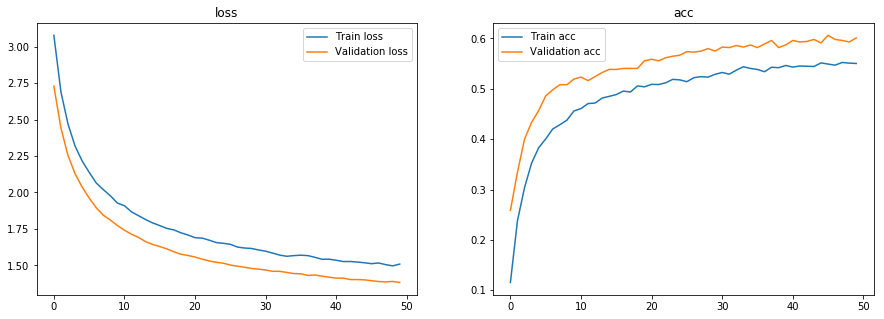
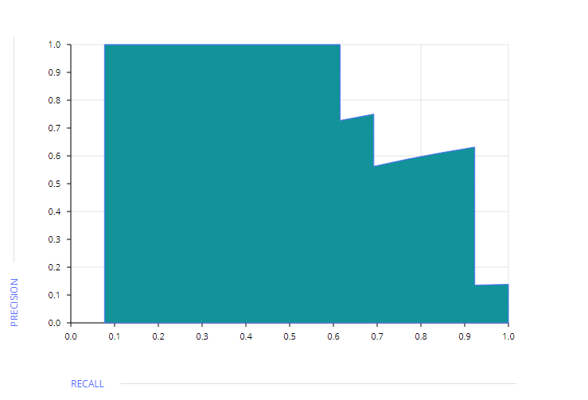
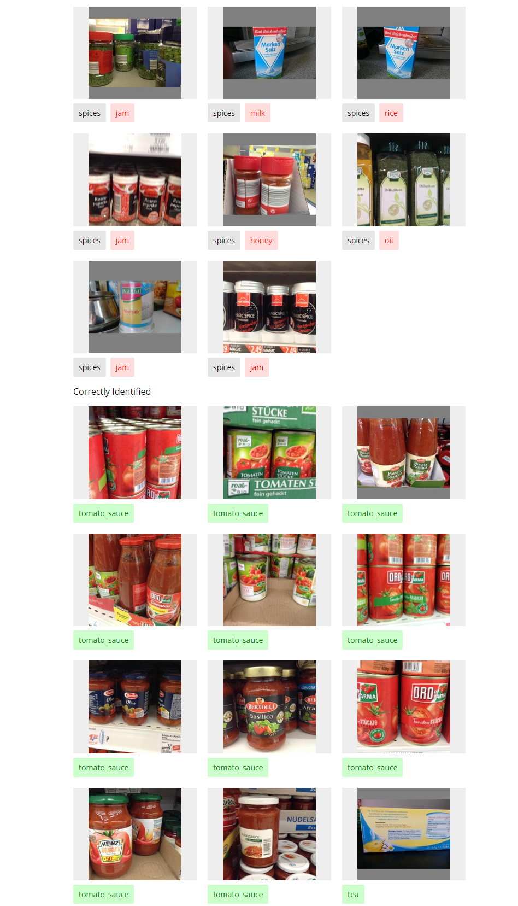

# Multi class object classification using Freiburg Groceries Dataset
Implementation of the paper "A Hierarchical Grocery Store Image Dataset with Visual and Semantic Labels"

## Citing

If you find this code useful in your research, please consider citing the blog:

```
@misc{sagarmulti,
  Author = {Abhinav Sagar},
  Title = {Multi Class Object Classification for Retail Products},
  Year = {2019},
  Journal = {Towards Data Science},
}
```

Check out the corresponding medium blog post [https://towardsdatascience.com/multi-class-object-classification-for-retail-products-aa4ecaaaa096](https://towardsdatascience.com/multi-class-object-classification-for-retail-products-aa4ecaaaa096).

The Freiburg Groceries Dataset consists of 5000 256x256 RGB images of 25 food classes. I have used Transfer Learning using pre trained 
VGG weights to make a model for multi class image classification. It can be of great use in automatic image
classification to help a food and groceries retailer reduce human effort in the inventory management process of its warehouse and retail 
outlets.

The paper can be found [here](https://arxiv.org/pdf/1611.05799.pdf) and the dataset [here](http://aisdatasets.informatik.uni-freiburg.de/freiburg_groceries_dataset). The full dataset is provided in this repository for convenience.



## Environment and tools

1. Jupyter Notebook
2. Numpy
3. Pandas
4. Scikit-image
5. Matplotlib
6. Scikit-learn
7. Keras

## Installation

`pip install numpy pandas scikit-image matplotlib scikit-learn keras`

`jupyter notebook`

## Results

### Loss/Accuracy vs Epoch



### ROC-AUC curve



### Correct/Incorrect classification samples



The model is able to reach a validation accuracy of 60% which is quite good considering the number of classes(25) with 100-200 images in each category. Feel free to use different architectures and play with the hyperparameters for better results.

## License

```
MIT License

Copyright (c) 2019 Abhinav Sagar

Permission is hereby granted, free of charge, to any person obtaining a copy
of this software and associated documentation files (the "Software"), to deal
in the Software without restriction, including without limitation the rights
to use, copy, modify, merge, publish, distribute, sublicense, and/or sell
copies of the Software, and to permit persons to whom the Software is
furnished to do so, subject to the following conditions:

The above copyright notice and this permission notice shall be included in all
copies or substantial portions of the Software.

THE SOFTWARE IS PROVIDED "AS IS", WITHOUT WARRANTY OF ANY KIND, EXPRESS OR
IMPLIED, INCLUDING BUT NOT LIMITED TO THE WARRANTIES OF MERCHANTABILITY,
FITNESS FOR A PARTICULAR PURPOSE AND NONINFRINGEMENT. IN NO EVENT SHALL THE
AUTHORS OR COPYRIGHT HOLDERS BE LIABLE FOR ANY CLAIM, DAMAGES OR OTHER
LIABILITY, WHETHER IN AN ACTION OF CONTRACT, TORT OR OTHERWISE, ARISING FROM,
OUT OF OR IN CONNECTION WITH THE SOFTWARE OR THE USE OR OTHER DEALINGS IN THE
SOFTWARE.
```


